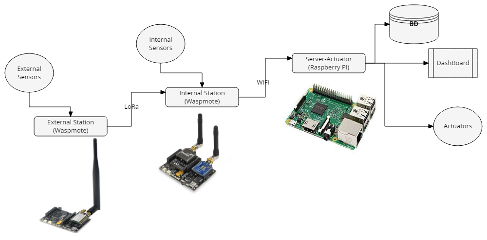
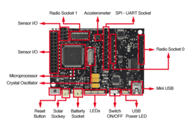
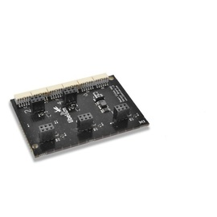
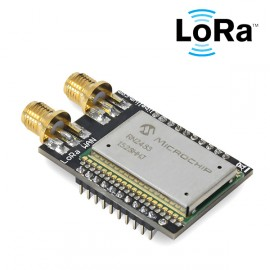
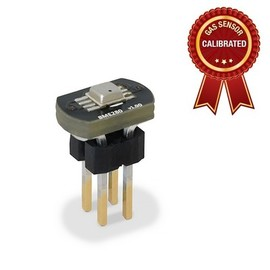
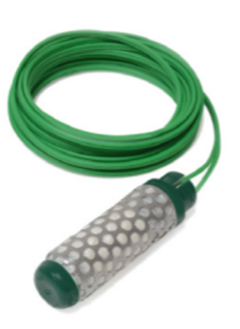
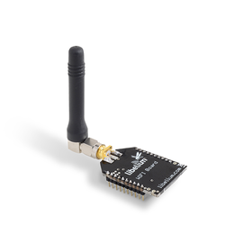

<h1>Smart GreenHouse UAL</h1>
<B>Authors:</B> Vitor Hugo Augusto Rodrigues, German Ruano Garcia, Claudio Peña Rodriguez
<h2>I) Project Description</h2>
In this project we will simulate the communication and data collection of the sensors of a greenhouse, we will also make a visualization in an application and act according to the collected data.
	

<h2>II) Advanced Description of the Project</h2>
This project will be divided into three parts, external station, internal station and server-actuator

<h2>II.I) External Station </h2>
In this part we will assemble the external station that will be responsible for measuring the external climate of the greenhouse.

It will collect the following data:

- Temperature
- Pressure
- Humidity
- Luminosity

<h3>External Station Assembly</h3>
For the assembly we will need:

- 1 x Waspmote
- 1 x Smart Cities Pro
- 1 x LoRa
- 1 x BME Sensor
- 1 x Luxe Sensor

| Component                 | Image                           |
| ------------------------- | ------------------------------- |
| Waspmote                  |      |
| Smart Cities Pro          |  |
| LoRa                      |           |
| BME Sensor                |           |
| Luxe Sensor               |         |

<h3>Read Sensors from External Station</h3>

<h3>Send Data with LoRa</h3>

<h2>II.II) Internal Station </h2>
In this part we will assemble the internal station that will be responsible for measuring the internal climate of the greenhouse.

It will collect the following data:

- Temperature
- Pressure
- Humidity
- Soil Moisture

<h3>Internal Station Assembly</h3>
For the assembly we will need:

- 1 x Waspmote
- 1 x Agriculture Sensor Pro
- 1 x LoRa
- 1 x BME Sensor
- 1 x Soil Moisture Sensor
- 1 x Wifi

| Component                 | Image                           |
| ------------------------- | ------------------------------- |
| Waspmote                  |      |
| Agriculture Sensor Pro    |  |
| LoRa                      |           |
| BME Sensor                |           |
| Soil Moisture Sensor      |         |
| Wifi                      |         |

<h3>Read Sensors from Internal Station</h3>

<h3>Send Data with Wifi</h3>

<h2>II.III) Server-Actuator </h2>