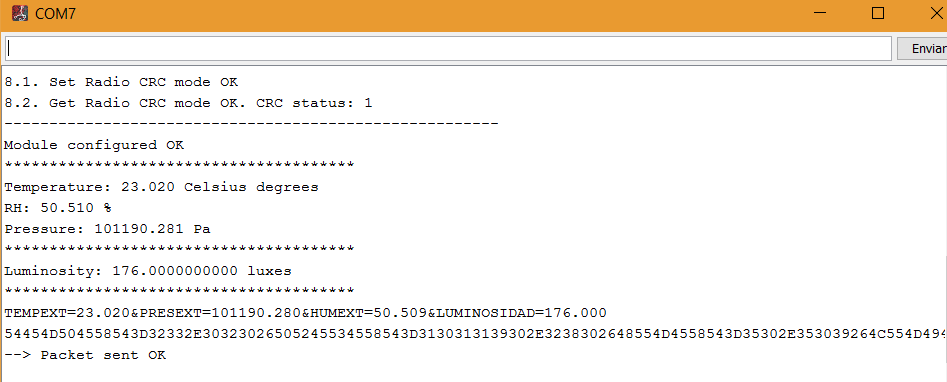

<h1>Smart GreenHouse UAL</h1>
<B>Authors:</B> Vitor Hugo Augusto Rodrigues, German Ruano Garcia, Claudio Peña Rodriguez
<h2>I) Project Description</h2>
In this project we will simulate the communication and data collection of the sensors of a greenhouse, we will also make a visualization in an application and act according to the collected data.
	

<h2>II) Advanced Description of the Project</h2>
This project will be divided into three parts, external station, internal station and server-actuator


<h2>II.I) External Station </h2>
In this part we will assemble the external station that will be responsible for measuring the external climate of the greenhouse.

It will collect the following data:

- Temperature
- Pressure
- Humidity
- Luminosity

<h3>External Station Assembly</h3>
For the assembly we will need:

- 1 x Waspmote
- 1 x Smart Cities Pro
- 1 x LoRa
- 1 x BME Sensor
- 1 x Luxe Sensor

| Component                 | Image                           |
| ------------------------- | ------------------------------- |
| Waspmote                  |      |
| Smart Cities Pro          |  |
| LoRa                      |           |
| BME Sensor                |           |
| Luxe Sensor               |         |


<h3>Read Sensors from External Station</h3>
In the external station we will use the smart cities board, so we must include this library.

```
#include <WaspSensorCities_PRO.h>
````

The first thing will be to initialize the sensors with their socket.

 

To read the values ​​of the sensors we will use the following code.

 

<h3>Send Data with LoRa</h3>
Now we have the sensors data so we can send them to the internal station.
For this purpose we will use the LoRa communication, so we need include this library.

```
#include <WaspLoRaWAN.h>
````

For this we only need use the example of communication with LoRa (P2P) include in the Waspmote IDE. And initialize the LoRa socket.

 

We should only know that LoRa sends the messages in hexadecimal, so we must convert the values ​​of the sensors, with this code for example.

 

When we have the hexadecimal messages we only need use this function.

```
sendRadio()
````

 

<h3>Output</h3>



<h2>II.II) Internal Station </h2>
In this part we will assemble the internal station that will be responsible for measuring the internal climate of the greenhouse.

It will collect the following data:

- Temperature
- Pressure
- Humidity
- Soil Moisture

<h3>Internal Station Assembly</h3>
For the assembly we will need:

- 1 x Waspmote
- 1 x Agriculture Sensor Pro
- 1 x LoRa
- 1 x BME Sensor
- 1 x Soil Moisture Sensor
- 1 x Wifi

| Component                 | Image                           |
| ------------------------- | ------------------------------- |
| Waspmote                  |      |
| Agriculture Sensor Pro    |  |
| LoRa                      |           |
| BME Sensor                |           |
| Soil Moisture Sensor      |         |
| Wifi                      |         |


<h3>Read Sensors from Internal Station</h3>


<h3>Send Data with Wifi</h3>

<h2>II.III) Server-Actuator </h2>
This is the last part of this project, in which we use a server to store collected data and act on some actuators according to these data.

The server will store the following data:

- BME Temperature
- BME Pressure
- BME Humidity
- Soil Moisture
- Soil Temperature
- External Temperature
- External Pressure
- External Humidity
- Luminosity

<h3>Server-Actuator Assembly</h3>
For the assembly we will need:

- 1 x Raspberry Pi 3
- 2 x LED
- 1 x Micro Servo 9g SG90

| Component                 | Image                           |
| ------------------------- | ------------------------------- |
| Raspberry Pi 3            | |
| LED                       | |
| Micro Servo 9g SG90       | |


<h3>Configuring the server</h3>

Our server will be a Raspberry Pi 3. The first thing we need to do is to configure it as a Web Server. To do that, we first create the "www-data" group. Type the following commands:

	sudo groupadd www-data
	sudo usermod -a -G www-data www-data
	
Afterwards, we need to update all repositories and programs of our Raspberry:

	sudo apt-get update
	sudo apt-get upgrade
	
Then, we need to install Apache:

	sudo apt-get install apache2
	

NOTE: Check that Apache was successfully installed by typing http://localhost/ in the address bar.


Now, we need to install PHP to be able to create dynamic content on our website. Type the following commands:

	sudo apt-get install php5
	sudo apt-get install libapache2-mod-php5 libapache2-mod-perl2 php5 php5-cli php5-common php5-curl php5-dev php5-gd php5-imap php5-ldap php5-mhash php5-mysql php5-odbc
	
Once this has been done, restart the Raspberry Pi:
	
	sudo reboot
	

Next, we install MySQL. To do that, type the following command:

	sudo apt-get install mysql-server mysql-client php5-mysql	
	
Once the installation has finished, we must restart the Raspberry Pi again. Now, we install phpMyAdmin to easily manage MySQL databases. Type the following command:

	sudo apt-get install libapache2-mod-auth-mysql php5-mysql phpmyadmin

During installation, it will ask us what type of server we have. We will mark "Apache" and continue. Then, it will ask us if we wantto configure a database, so we will say "YES" and ask us to enter the MySQL password twice. At the end, we will edit the following file:

	sudo nano /etc/php5/apache2/php.ini

And add the following line:

	extension=mysql.so
	
We will save the file and then enter http://IP_RASPBERRY/phpmyadmin on the browser. The user will be "root" and the password will be the one we have chosen before.

<h3>Create a new Database</h3>

Once the Raspberry Pi has been configured as a Web Server, we need to create a new database which will store data received from the external and internal stations, so we log into phpMyAdmin and create a new database called "infraiot" which will have a table called "datos". The structure of this table is shown in the following figure, so we create a field for each type of information that the server receives from the stations, and also a field for each actuator ("ventana", "riego" and "calefaccion"), so that we can make decisions to turn on/off an actuator depending on the received data.


<h3>Connect to the Database and inserting data in it</h3>

In this section, we will explain and show the code used to connect to our database and to insert data in it.

In the file [insertar.php](server_src/smartgreenhouse/insertar.php), we


